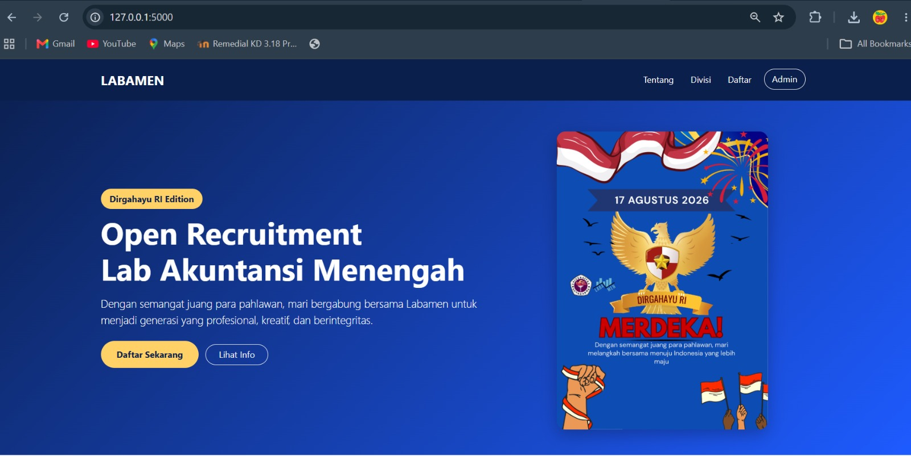
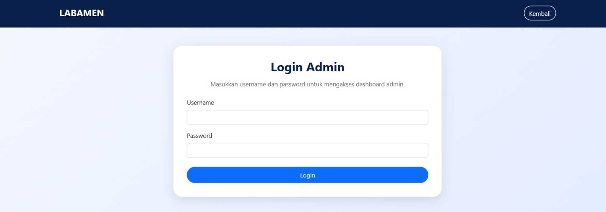
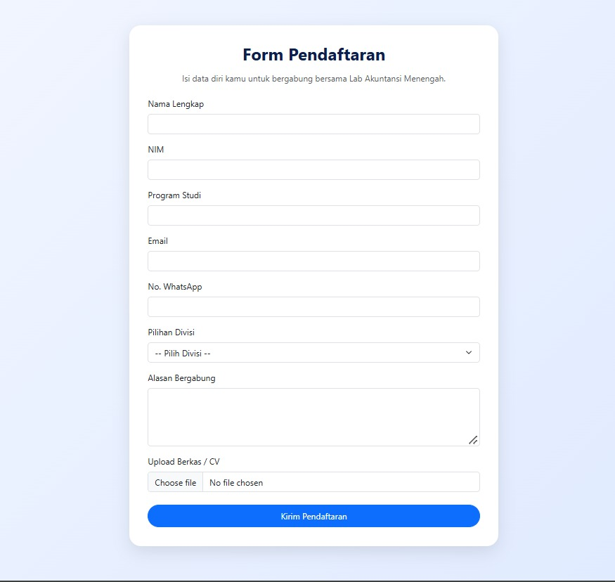
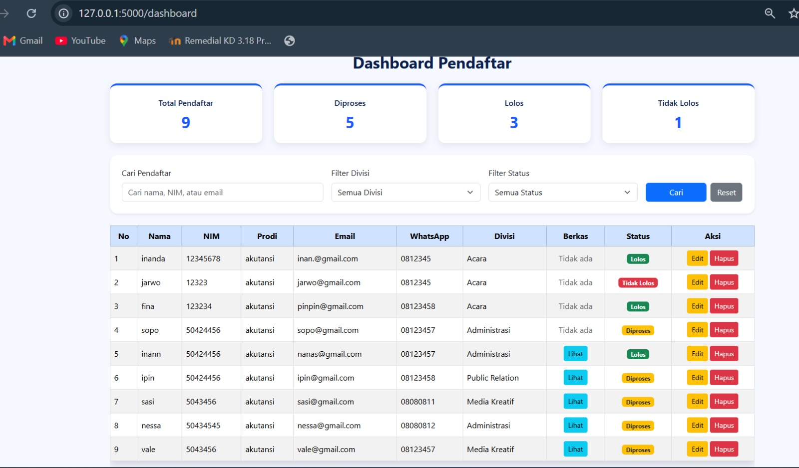
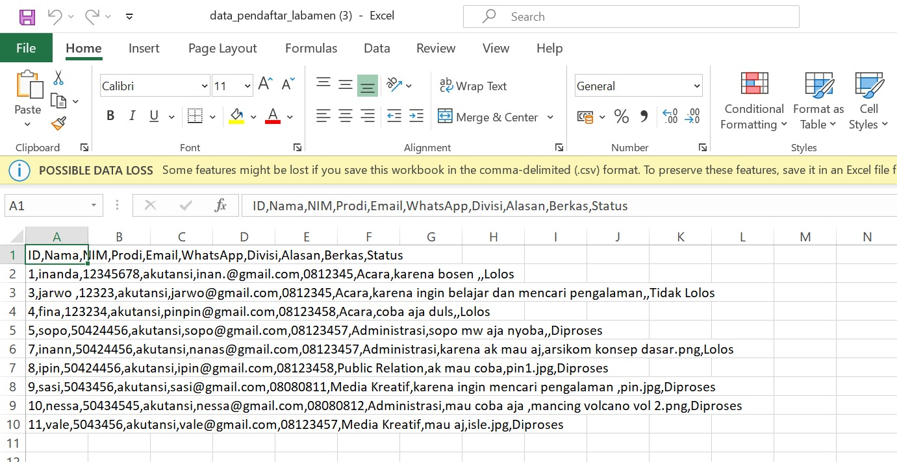

# recruitment-management-system-web-
A web-based recruitment management system for managing applicants, featuring CRUD operations, data filtering, status updates, and Excel export.

# Recruitment Management System

A web-based recruitment management system developed to manage applicant registration and the recruitment process.

## Features

- Applicant CRUD operations
- Applicant data filtering
- Recruitment status management
- Applicant file upload
- Excel-compatible data export
- Login and authentication
- Dashboard for managing applicant data

## Tech Stack

- Python
- Flask
- SQLite
- HTML
- CSS
- JavaScript

## Project Overview

This project was developed as a web-based system to support the management of an open recruitment process. It provides functionality for managing applicant data, updating recruitment statuses, filtering records, and exporting applicant data for further processing.

## Screenshots

### Landing Page



### Login


### Dashboard



### Applicant Management



### Data Export



## Project Structure

```text
recruitment-management-system/
├── static/
│   ├── css/
│   ├── js/
│   └── images/
├── templates/
├── uploads/
├── app.py
└── README.md

author inanda kalsa 
